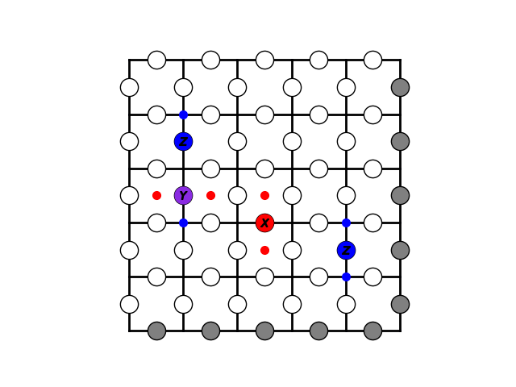
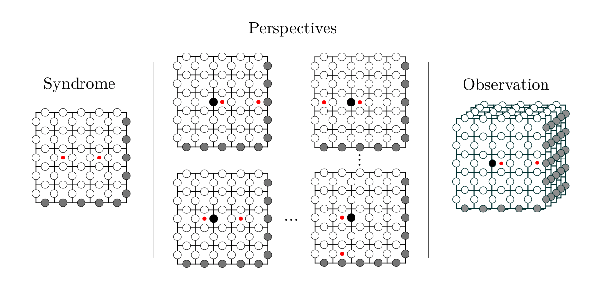

# toric_model

This class includes all the functions to initialize, alter and display the toric code.  

## Constructor 
- system_size: the size of the 2d grid (see gif d=5)
- plaquette_matrix: dxd matrix containing the excitations in the plaquette space (int)
- vertex_matrix: dxd matrix containing the excitations in the vertex space (int)
- qubit_matrix: The 2xdxd matrix is initialized with only 0 (ground state without trivial and non trivial loops). It contains the current qubit state. Identity = 0, pauli_x = 1, pauli_y = 2, pauli_z = 3.
- current_state: 2xdxd matrix of vertex and plaquette matrix of the current state
- next_state: 2xdxd matrix of vertex and plaquette matrix of the next state (after taking an action)
- ground_state: boolean: True, ground state is conserved error correction successful; False, non trivial loops, error correction failed.
- rule_table: covering the interaction of different pauli operators acting on the same qubit. 

## Perspectives approach
To reduce the complexity of the problem, we used 

## Functions
- generate_random_error(p_error): generate syndrome with equal probability of x,y and z errors given the error probability p_error.
- generate_n_random_errors(n):  generate syndrome with equal probability of x,y and z errors given a specified amount of errors (n).
- syndrome(state): generating the syndrome given the qubit_matrix and save the syndrome either in current_state or next_state.
- terminal_state(state): checks given the state whether there are excitations left. 
- eval_ground_state(): given the qubit_matrix the function checks whether there are any non trivial loops that changed the logical qubit state. If ground state is true and terminal is 0, the error correction was successful.
-step(action): executes an action on the toric code. Action is a named tuple defined in util.py. It includes the position of the qubit and the operator.

